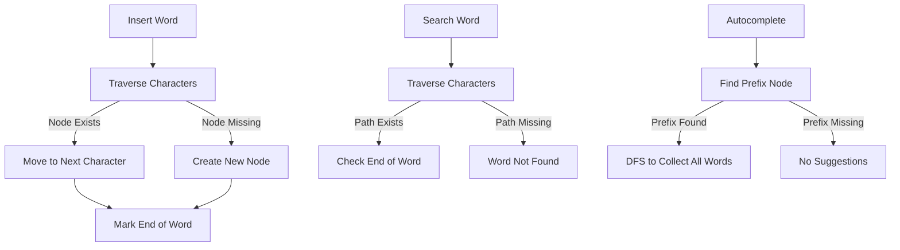

# 🌳 Trie Data Structure Implementation

  


A **C++ implementation of the Trie (Prefix Tree)** designed to efficiently manage word storage, retrieval, and prefix-based operations.
This project was developed as part of the **FuzeTek Summer Internship 2025 (Project 4)** to practice Object-Oriented Programming (OOP) principles, algorithm design, and real-world applications of data structures.

---

## 🚀 Features

- ✅ **Word Insertion** → Add new words to the Trie.  
- ✅ **Word Search** → Check if a complete word exists.  
- ✅ **Prefix Checking** → Verify if any word starts with a given prefix.  
- ✅ **Autocomplete** → Suggest all words that match a given prefix, sorted by frequency.  
- ✅ **Longest Prefix Match** → Find the longest prefix of a string that is a valid word in the Trie.  
- ✅ **Longest Word With Prefix** → Return the longest complete word that starts with a given prefix.  
- ✅ **Word Deletion** → Remove a word and clean up unused nodes.  
- ✅ **Frequency Tracking** → Tracks insert and search frequencies of words.  
- ✅ **Extended Character Support** → Supports both standard lowercase and extended Unicode characters.  
- ✅ **Test Suite** → Validates all edge cases and core functionalities.  

---

## 📂 System Architecture

The project follows a clean **OOP design**:

| Class      | Responsibility |
|------------|----------------|
| `TrieNode` | Represents each node in the Trie with fixed and dynamic child mappings, plus frequency tracking. |
| `Trie`     | Core interface for Trie operations: insert, delete, search, prefix matching, autocomplete, longest prefix/word, and more. |
| `Main`     | Demonstrates usage and executes comprehensive test cases. |

---

## 🖼️ Visual Representation



---

## 📖 Example Usage

```cpp
#include "trie.h"

Trie trie;

// Insert words
trie.insert("apple");
trie.insert("application");
trie.insert("banana");

// Search
trie.search("apple");      // true
trie.search("app");        // false

// Prefix checking
trie.startsWith("app");    // true

// Autocomplete
auto suggestions = trie.autocomplete("app");
// → sorted list of pairs like: [("apple", freq), ("application", freq)]

// Longest Word With Prefix
trie.longestWithPrefix("ban");  
// → "banana" or "bandana" depending on what's inserted

// Longest Prefix Match (useful for routing)
trie.LongestPrefixMatch("banistered");  
// → "banister"

// Delete word
trie.deleteWord("banana");  
```

---

## 📑 Applications

Tries are foundational in many real-world applications:

- 🔍 **Search Engines** → Autocomplete and query suggestions  
- 📖 **Spell Checkers** → Fast lookup and word correction  
- 📱 **Contact Lists** → Efficient prefix-based search  
- 📚 **Dictionary Apps** → Lexicographical word retrieval  
- 🌐 **IP Routing** → Longest prefix matching in routing tables  
- 🎮 **Games** → Word validation in puzzles and anagram solvers  

---

## ⚙️ Installation & Usage

1. Clone the repository:
   ```bash
   git clone https://github.com/Sondos100/Trie-DS-Implementation.git
   ```
3. Compile the code using any C++ compiler (e.g., `g++`, `clang++`):
   ```bash
   g++ -std=c++17 main.cpp -o trie
   ```
5. Run the program:
   ```bash
   ./trie
   ```

---

## 🧪 Test Coverage

The project includes tests for:

- Word insertion and duplicate detection  
- Case sensitivity and extended characters  
- Autocomplete with sort by frequency  
- Longest word with prefix 
- Word deletion and cleanup  
- Longest prefix match  
- Count of words and prefix count  
- Lexicographical listing of all stored words  

---

## 🎯 Learning Outcomes

Through this project, we gained hands-on experience in:

- Designing **tree-based data structures** from scratch  
- Applying **Object-Oriented Programming** principles in C++  
- Managing **dynamic memory safely** with recursive deletion  
- Solving real-world problems like **autocomplete and prefix search**  
- Writing **robust, modular, and maintainable code**  

---

## 🤝 Credits

Developed by **Team 4** during the
**FuzeTek Summer Internship 2025 – Project 4: Data Structures in Practice**

**Team Members:**
- Sondos Ahmed (Leader)
- Ahmed Abdelrasoul    
- Alaa Tarek  
- Khaled Bishr  
- Muhammed Albahagy.

