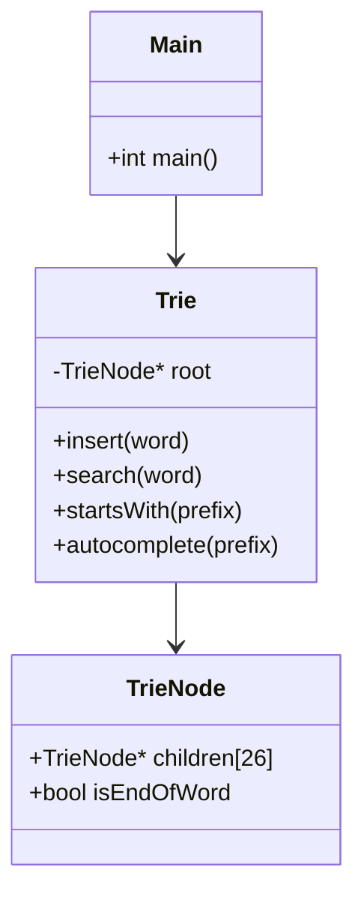

# 🌳 Trie Data Structure Implementation

  


A **C++ implementation of the Trie (Prefix Tree)** designed to efficiently manage word storage, retrieval, and prefix-based operations.  
This project was developed as part of the **FuzeTek Summer Internship 2025 (Project 4)** to practice **Object-Oriented Programming (OOP)** principles, algorithm design, and real-world applications of data structures.

---

## 🚀 Features

- **Word Insertion** → Add new words to the Trie.  
- **Word Search** → Check if a complete word exists.  
- **Prefix Checking** → Verify if words start with a given prefix.  
- **Autocomplete** → Suggest words that match a prefix.  
- **Edge Case Handling** → Handles empty strings, non-existent prefixes, and case sensitivity.  
- **Test Suite** → Includes multiple scenarios to validate functionalities.  

---

## 📂 System Architecture

The project is designed with an **OOP approach**:

| Class      | Responsibility |
|------------|----------------|
| `TrieNode` | Represents a node with up to 26 children and an end-of-word flag. |
| `Trie`     | Provides core operations: insert, search, prefix checking, autocomplete. |
| `Main`     | Runs test cases and demonstrates Trie functionalities interactively. |

---

## 🖼️ Visual Representation

Here’s a high-level diagram of the Trie architecture:



---

## 📖 Example Usage

```cpp
#include "trie.h"

Trie trie;

// Insert words
trie.insert("apple");
trie.insert("application");
trie.insert("banana");

// Search
trie.search("apple");      // true
trie.search("app");        // false

// Prefix checking
trie.startsWith("app");    // true

// Autocomplete
vector<string> results = trie.autocomplete("app");
// results → ["apple", "application"]
```

---

## 📑 Applications

Tries are widely used in real-world systems such as:

- 🔍 **Search Engines** → Autocomplete and query suggestions  
- 📖 **Spell Checkers** → Word lookup and corrections  
- 📱 **Contact Lists** → Quick name suggestions  
- 📚 **Dictionary Implementations** → Efficient storage and retrieval  

---

## ⚙️ Installation & Usage

1. Clone the repository:
   ```bash
   git clone https://github.com/username/Trie-DS-Implementation.git
   ```
2. Compile the code:
   ```bash
   g++ Template_Code.TXT -o trie
   ```
3. Run the program:
   ```bash
   ./trie
   ```

---

## 🎯 Learning Outcomes

Through this project, we gained experience in:

- Implementing efficient **tree-based data structures**.  
- Applying **OOP design principles** in C++.  
- Writing **modular and testable code**.  
- Understanding real-world applications of Tries in software systems.
  
